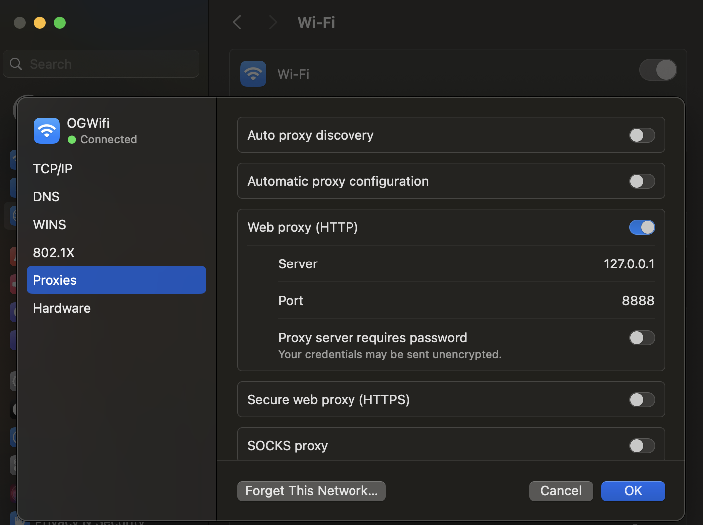
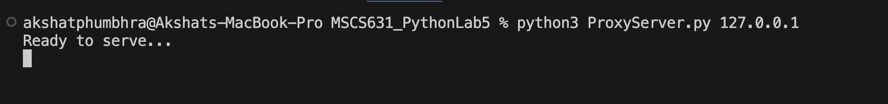
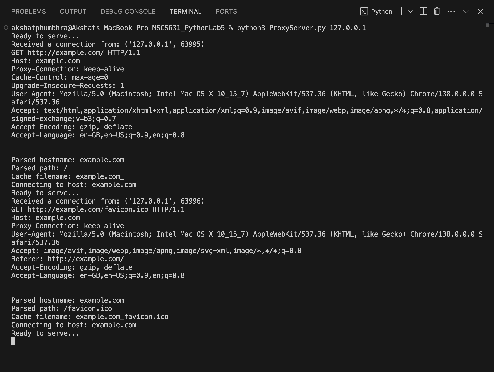
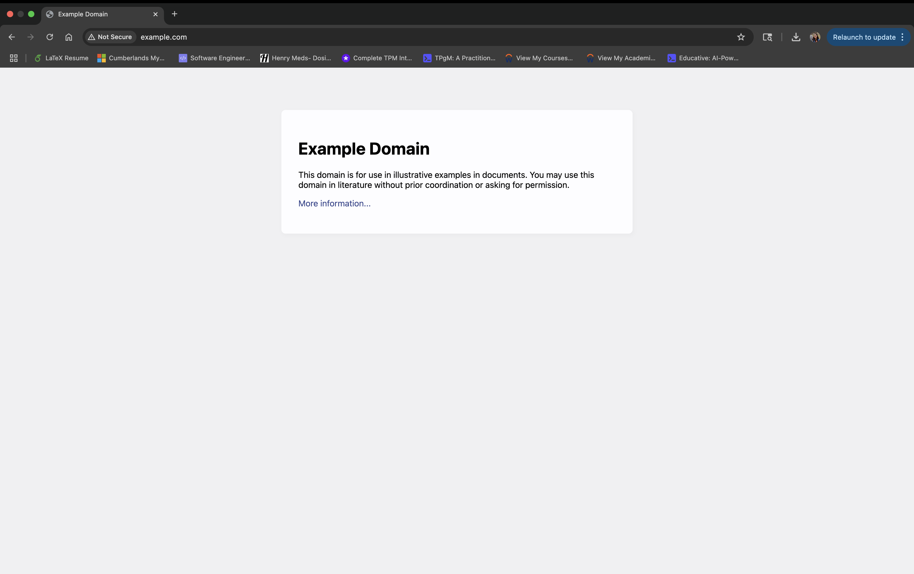

# Lab 5: Web Proxy

### Oishani Ganguly

## Reflection on the Lab Experience

This lab provided valuable hands-on experience in building a basic HTTP proxy server and understanding the flow of web traffic between a browser, proxy, and web server. Setting up the proxy and configuring the browser to route traffic through it allowed me to observe real-time HTTP requests and responses, as well as see the benefits of local caching. It was exciting to see web pages load successfully through my own proxy server implementation and to verify the caching mechanism by observing terminal logs and cache files. This exercise reinforced my understanding of socket programming, HTTP protocol details, and the foundational concepts behind web proxies and content caching.

## Challenges Encountered

One of the primary challenges was adapting the skeleton code to handle the way modern browsers communicate with proxy servers. The original skeleton assumed a simplified request format, but browsers send the full URL in the HTTP GET line when using a proxy. As a result, I needed to adjust the code to reliably parse the full URL, extract the correct hostname and path, and generate safe cache file names. Additionally, I modified the file handling to use binary mode so that the proxy could correctly cache and serve not just HTML, but also images and other file types. These changes were necessary to ensure compatibility with real-world browser behavior and to fulfill the core requirements of the assignment. Without these adjustments, the proxy would have been unable to forward requests or cache responses correctly, especially for sites beyond basic text pages.

## Screenshots

*Mac system network settings showing manual configuration of the HTTP web proxy to use 127.0.0.1 on port 8888. This ensures that all browser HTTP requests are routed through the local proxy server for testing and verification.*

---

*Proxy server started successfully and is ready to accept client connections.*

---

  
*Terminal output showing the proxy server receiving and parsing HTTP requests from Chrome for example.com, including both the main HTML page and favicon requests. The server logs show successful extraction of hostname and path, as well as attempts to connect to the target web server.*

---

  
*Chrome browser successfully loads "Example Domain" via the local proxy server, verifying that the proxy is correctly handling and forwarding HTTP requests.*
